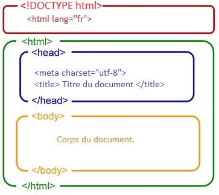

# Développement web

**Instructions** 
Vous allez créer une carte de visite interactive. Celle-ci devra contenir vos informations et changer de couleur lorsqu'on cliquera sur le bouton. 

**Objectifs**
1. Apprendre les bases du HTML, structure et balises courantes
2. Découvrir le CSS
3. Introduire un peu de javascript pour intéragir avec les éléments de la page


[Accès à l'exercice sur codepen](https://codepen.io/ffremont/pen/MYgQqZb)
---

### **Étapes à suivre**

#### **Étape 1 : Comprendre la structure HTML**
> ##### **C'est quoi le HTML ?**
> C'est le langage de balisage qui permet de structurer le contenu d'une page web.  
> C'est le principe d'une armoire à tiroirs : 
> on a des éléments qui contiennent d'autres éléments, et ainsi de suite.  
> On peut également mettre des étiquettes sur ces tiroirs pour identifier leur contenu.  
>   
> 
>   
> Lien vers la documentation HTML : https://developer.mozilla.org/fr/docs/Web/HTML


1. Commencez avec le squelette fourni [ici](https://codepen.io/ffremont/pen/MYgQqZb).
2. **Ajoutez les éléments suivants dans le corps du document :**
   - Une balise `<button>` avec le texte " Changer la Couleur " [documentation](https://developer.mozilla.org/fr/docs/Web/HTML/Element/button).
3. Remplacez le texte par vos propres informations :
   - Dans `<h1>` (balise de titre), ajoutez vos prénom et nom.
   - Dans `<p>` (balise paragraphe), écrivez une phrase qui vous décrit.


<details>
  <summary>Proposition de correction</summary>

```html
<div class="carte">
  <h1 class="titre" id="name">Jeanne Dupont</h1>
  <p class="paragraphe" id="info">Développeuse curieuse et passionnée par le web !</p>
  <button class="bouton" id="changeColorBtn">Changer la Couleur</button>
</div>
```
</details>


---

#### **Étape 2 : Ajouter du style avec CSS**

> ##### **C'est quoi le CSS ?**
> C'est le langage qui permet de styliser les pages web.
> c'est comme la décoration d'une maison :
> on peut changer les couleurs, les tailles, les polices, etc.
>  
> Lien vers la documentation CSS : https://developer.mozilla.org/fr/docs/Web/CSS

Nous allons maintenant travailler dans la partie CSS de codepen.

1. **Commençons par ajouter une touche de couleur et le choix d'une police de caractères**
   - Pour ajouter du contenu sur notre carte de visite, il faut d'abord cibler les éléments HTML avec des sélecteurs CSS.
   - Nous allons donc écrire dans la partie CSS `.carte {}`
   - À l'intérieur des accolades, nous allons ajouter les propriétés `border`, `background-color` et `font-family` pour ajouter une bordure, changer la couleur de fond et changer la police de caractères.
2. **Maintenant, nous allons faire un peu de mise en forme**
   - Ajoutez un peu de marge autour de la carte avec la propriété `padding`.
   - Centrez le texte avec `text-align`.
   - Arrondissez les coins de la carte avec `border-radius`.
   - Ajustez la taille de la carte avec `width`.

<details>
<summary>Proposition de correction</summary>
    
```css
    .carte {
         border : solid;
         background-color: lightGrey;
         font-family: Arial, sans-serif;
         padding : 10px;
         text-align: center;
         width: fit-content;
    }
```
</details>

3. **Pour aller plus loin avec le CSS, découvrons les `flexbox` ([lien vers une super doc](https://css-tricks.com/snippets/css/a-guide-to-flexbox/)).**
   - Pour que l'utilisation des flexbox soit plus parlante, copiez votre code HTML et collez-le une ou plusieurs fois en dessous. Vous aurez ainsi plusieurs cartes de visite.
   - Ajoutez un sélecteur CSS sur le corps de la page avec `body {}`.
   - Ajoutez la propriété `display : flex;`.
   - Que remarquez-vous ? Les cartes sont-elles alignées horizontalement ou verticalement ? Savez-vous pourquoi ?
   - Ajoutez les propriétés `justify-content` et `gap`.
 

<details>
  <summary>Proposition de correction</summary>
  
```css
body {
   display : flex;
   justify-content : center;
   gap : 10px;
}
```
</details>

---

#### **Étape 3 : Ajouter un peu d’interactivité avec JavaScript**

> ##### **C'est quoi le Javascript ?**
> C'est le langage de programmation qui permet d'ajouter de l'interactivité aux pages web.
> Plus précisément, il pourrait permettre, dans notre cas, d'ajouter une carte de visite dans la page ou bien comme nous allons vous le proposer de changer la couleur de notre carte de visite.
>  
> Lien vers la [documentation JavaScript](https://developer.mozilla.org/fr/docs/Web/JavaScript)


1. **Ajoutez une logique JavaScript simple dans la partie Js de codepen pour changer la couleur du fond de la carte :**
   - Tout d'abord, nous allons accéder au bouton en utilisant `document.getElementById` et nous allons stocker cette référence dans une `const`.
   - Javascript permet en autre d'accéder aux actions que vous allez faire en tant qu'utilisateur sur la page. Nous allons écouter ce qui passe au moment du clic sur le bouton avec `addEventListener`.
   - Maintenant que nous avons un écouteur en place, nous allons dire que la couleur de notre carte va changer. 
     - Il va falloir utiliser un `document.querySelector` pour aller chercher la carte.
     - Il va ensuite falloir lui attribuer une nouvelle couleur en accédant à la propriété `style.backgroundColor`.


<details>
  <summary>Proposition de correction</summary>
  
```javascript
// Récupération des éléments du DOM
const changeColorBtn = document.getElementById('changeColorBtn');
const cardElement = document.querySelector('.carte');

// Tableau de couleurs
const colors = ['#FF5733', '#33FF57', '#3357FF', '#F333FF', '#FFC133'];

// Fonction pour changer la couleur aléatoirement
changeColorBtn.addEventListener('click', () => {
  const randomColor = colors[Math.floor(Math.random() * colors.length)];
  cardElement.style.backgroundColor = randomColor;
});
```
</details>

---

#### **Étape Bonus : Personnalisation avec une balise image**
1. Ajoutez une image à votre carte de visite :
   - Ajoutez une image avec la balise `` (par exemple, une photo de profil, sinon vous pouvez prendre [celle-ci]()).
2. L'image est un peu imposante non ?
   - Ajoutez du CSS ! il y a des attributs qui permettent de changer la hauteur et la largeur des éléments.

<details>
  <summary>Proposition de correction</summary>

```html
    
```
```css
    .photo {
      width: 100px;
      height: 100px;
      border-radius: 50%;
    }
```
</details>

---

### **Résumé**
À la fin de l'atelier, chaque participante aura :
1. Une page web basique avec HTML.
2. Une carte stylisée avec CSS.
3. Une interaction simple grâce à JavaScript.
4. Une carte de visite avec une image.
